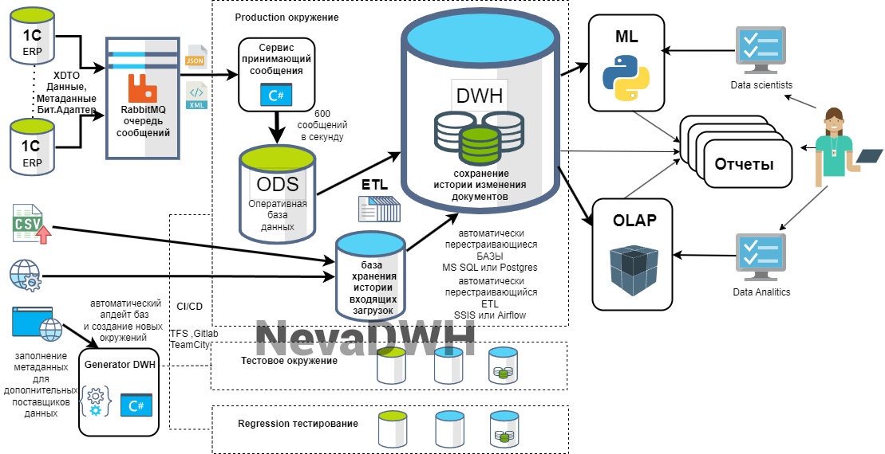
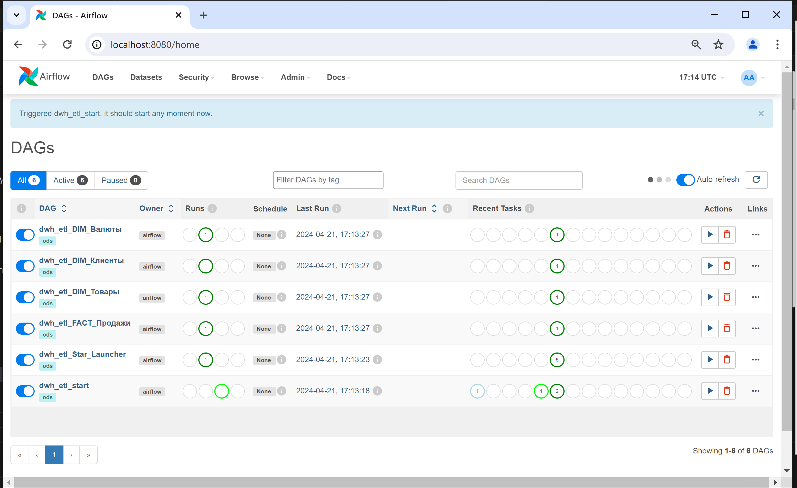

# NevaDWH

Generated DWH sample by NevaDWH generator. PostgreSql (folder dbpsql) and MSSQL (folder dbmssqll) version.

For start run ./start.ps1 batch on PowerShell 7.4 in Admin mode.

Результат генерации DWH из метаданных 1С

[http://localhost:8100]()     - Панел управления

Rabbit
[http://localhost::15672]()
admin
admin

## ETL Airflow

[http://localhost:8080]()
airflow
airflow

[http://localhost:8090/swagger]()

[http://localhost:8092/swagger]()
