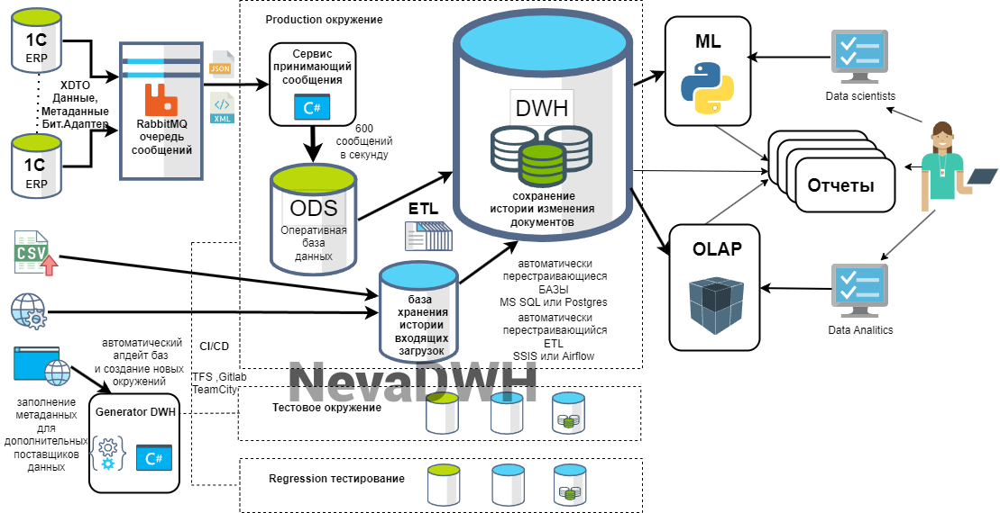
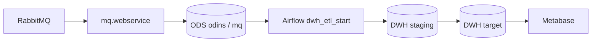
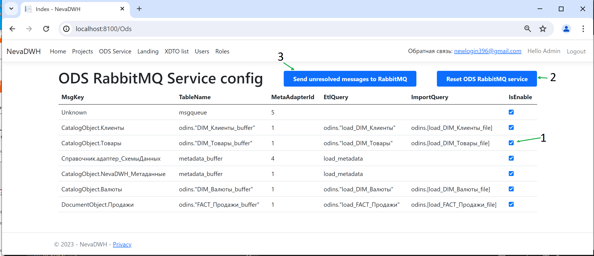
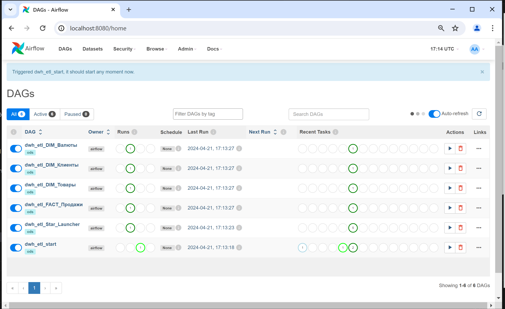
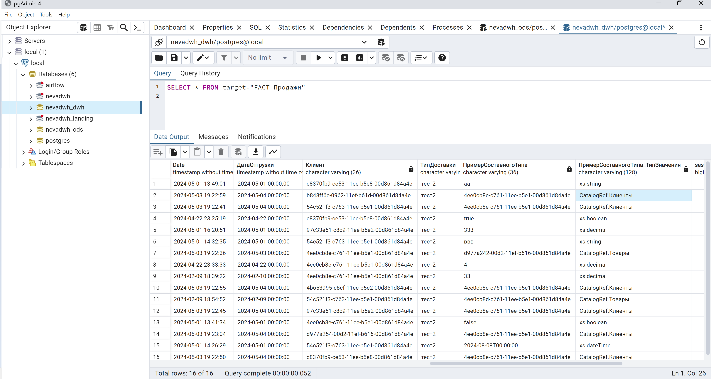
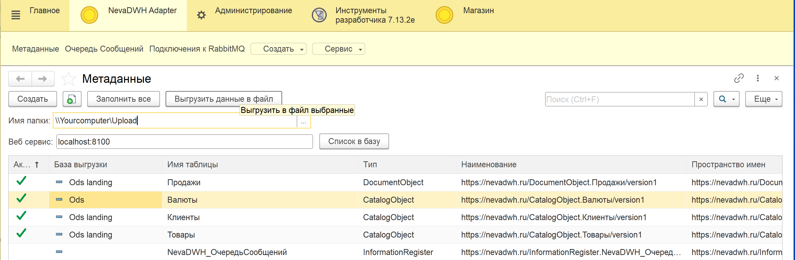
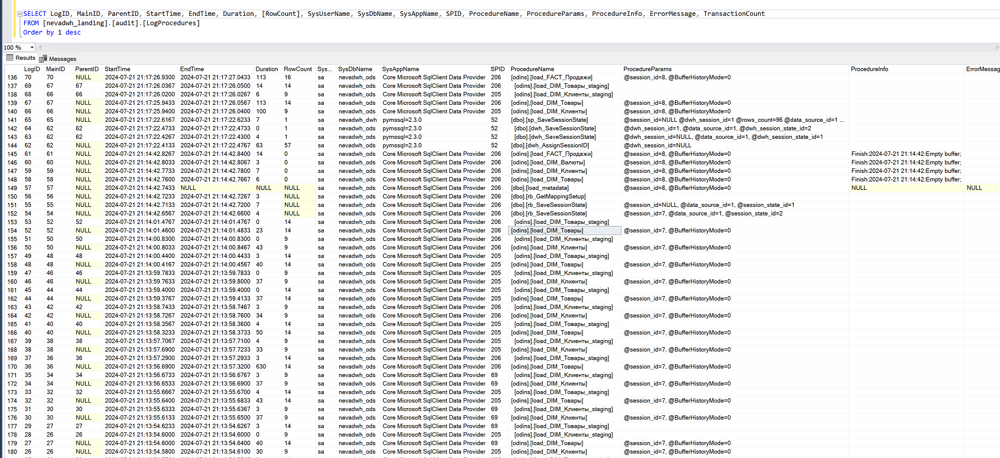

# NevaDWH

Результат генерации DWH из XML/JSON-метаданных 1С (выгрузка `1cv8.exe /DumpConfigToFiles`, Бит.Адаптер и др.).  
В репозитории две готовые версии стенда:

| Папка | СУБД ODS / DWH / Landing | Compose |
|-------|--------------------------|---------|
| [`dbpsql/`](./dbpsql) | **PostgreSQL** в Docker (`client-postgresdb17`) | полный стек в контейнерах |
| [`dbmssql/`](./dbmssql) | **MS SQL Server** на хосте | Airflow / Rabbit / MQ / UI в Docker |

Цель генератора — при изменении структуры 1С автоматически перестраивать схемы ODS/DWH и ETL (Airflow), добавляя новые поля в конечные таблицы.



---

## Стек стенда

Публичный вход с хоста — **Traefik `:80`** (PathPrefix / Host, без StripPrefix). Прямые порты контейнеров оставлены для отладки / `db-tests.ps1`.

| Сервис | Через Traefik | Прямой порт (debug) | Учётка |
|--------|---------------|---------------------|--------|
| Панель NevaDWH | http://localhost/ | http://localhost:8100 | первый пользователь — через UI / seed Admin |
| Metabase BI | http://bi.localhost | http://localhost:3000 | **admin@neva.loc / admin** |
| MQ WebService | http://localhost/v1/mq/swagger | http://localhost:8090/v1/mq/swagger | — |
| Landing | http://localhost/v1/landing/swagger | http://localhost:8092/v1/landing/swagger | — |
| Generator | http://localhost/v1/xdto/api/swagger | http://localhost:8110/api/swagger | — |
| RabbitMQ Management | http://localhost/rabbit/ | http://localhost:15672 | **admin / admin** |
| Airflow 3 UI / API | — (не за Traefik) | http://localhost:8080 | **admin / admin** |
| Traefik dashboard | http://traefik.localhost | — | — |

**dbpsql (Postgres):** ODS `newadwh_ods`, DWH `newadwh_dwh`, Landing `newadwh_landing`  
(хост с машины: `localhost:54321`, user/password `postgres` / `postgres`).

**dbmssql:** ODS/DWH/Landing на локальном SQL Server (`NevaDWH-DEMO_*`, учётки из `dbmssql/.env`).

Приложения MQ / Landing / Generator / Admin в этом репозитории берутся с Docker Hub (`raulamailru/nevadwh-*`). Airflow, Rabbit и Metabase — из `dbpsql/images` / `dbmssql/images` (Metabase — официальный образ + `metabase-init`).


```mermaid
flowchart LR
  RMQ[RabbitMQ]
  MQ[mq.webservice]
  ODS[(ODS odins / mq)]
  AF[Airflow dwh_etl_start]
  STG[(DWH staging)]
  TGT[(DWH target)]
  MB[Metabase]

  RMQ --> MQ --> ODS
  ODS --> AF --> STG --> TGT
  TGT --> MB
```

**Поток данных**

1. Сообщения из `mq.msgqueue` / `mq.MessageQueue` уходят в Rabbit (`send-unresolved-msg`).
2. **MQ** пишет в ODS (`odins.*`, включая табличные части вроде `FACT_Продажи_Товары` / `FACT_Продажи.Товары`).
3. **Airflow** `dwh_etl_start` → `dwh_etl_Star_Launcher` → DIM/FACT publish в DWH **staging**, затем **target**.
4. **Metabase** (demo) читает отчётные view `target.v_rpt_*`.

### Именование дат

| Стенд | Стиль | Поля |
|-------|--------|------|
| **dbmssql** | Pascal | `CreatedAt` / `UpdatedAt` |
| **dbpsql** | snake_case | `created_at` / `updated_at` |

---

## Demo-отчёты и Metabase

При `DEMO_STAND=true` (в `dbpsql/.env` по умолчанию) в DWH есть view:

| View | Назначение |
|------|------------|
| `target.v_rpt_sales` | продажи (шапка) |
| `target.v_rpt_sales_products` | строки продаж + товар |
| `target.v_rpt_products` | справочник товаров |

Metabase поднимается в compose, dashboard «Продажи и товары» настраивает `metabase-init`.  
Вход: http://bi.localhost — **admin@neva.loc / admin**.

В админке: меню **BI / Metabase**, журнал **Сессии MQ** (`mq.session_log` по слоям ODS / Landing / DWH).

---

## Prerequisites

- Windows 10/11, PowerShell 5.1+ (рекомендуется 7.x)
- [Docker Desktop](https://www.docker.com/)
- Для **dbpsql**: достаточно Docker
- Для **dbmssql**: SQL Server 2019/2022 на хосте, Visual Studio / MSBuild + SqlPackage, модуль `VSSetup`:

```powershell
Set-ExecutionPolicy -ExecutionPolicy Bypass -Scope LocalMachine
Install-Module VSSetup -Scope AllUsers
```

Первый запуск `start.ps1` — **от администратора** (SMB share `Upload` для MSSQL XML-адаптера).

---

## Быстрый старт

### PostgreSQL (`dbpsql`)

```powershell
cd .\dbpsql
docker compose build
.\start.ps1
```

Обновление без полного пересоздания:

```powershell
.\start.ps1 -IsUpdate
```

Только пересборка init SQL для `docker-entrypoint-initdb.d` (без Docker):

```powershell
.\start.ps1 -ScriptsOnly
```

После смены major Airflow — сброс metadata volume:

```powershell
docker compose down --volumes
docker compose up airflow-init
docker compose up -d
```

После существенной смены схемы ODS (например rename `dt_*` → `created_at`) удобнее пересоздать volume Postgres:

```powershell
docker compose down --volumes
.\start.ps1
```

### MS SQL (`dbmssql`)

```powershell
cd .\dbmssql
docker compose build
.\start.ps1          # dacpac deploy + compose
.\start.ps1 -IsUpdate
```

---

## Автотесты пайплайна (`db-tests.ps1`)

В корне репозитория:

| Файл | Назначение |
|------|------------|
| [`db-tests.ps1`](./db-tests.ps1) | подъём compose + General pipeline |
| [`db-tests.engines.ps1`](./db-tests.engines.ps1) | SQL/хелперы mssql и psql (UTF-8 BOM) |

Отчёты: `.\TestReport\` (`latest-db-NevaDWH-dbpsql.md` и т.п.).

### Что проверяет `-General` (по умолчанию)

1. **Compose** — `up` стенда, health MQ и Airflow (при переключении `dbpsql` ↔ `dbmssql` оба проекта снимаются через `compose down`, тома сохраняются).
2. **Phase 1** — `POST /v1/mq/service/send-unresolved-msg` → ожидание свежих строк в `odins` (DIM / FACT + табличная часть `FACT_Продажи_Товары` / `.Товары`; буферы `*_buffer`).
3. **Phase 2** — trigger DAG `dwh_etl_start`, ожидание `success`.
4. **Phase 3** — в DWH есть строки в `staging` и `target`; для продаж проверяется, что строки табличной части не пустые по полям (`Товар` / qty).

### Команды

```powershell
# из корня репозитория
.\db-tests.ps1 dbpsql              # полный прогон Postgres
.\db-tests.ps1 dbpsql -Build       # с пересборкой образов
.\db-tests.ps1 dbpsql -SkipCompose # стенд уже поднят
.\db-tests.ps1 dbpsql -ClearData   # truncate odins перед Phase 1

.\db-tests.ps1 dbmssql -Build
.\db-tests.ps1 dbmssql -SkipCompose
```

### Ручной сценарий (UI) — то же, что делает тест

1. Панель http://localhost/ → ODS Service: включить обработку Rabbit, Reset MQ, **Send unresolved messages**.
2. Airflow http://localhost:8080 (**admin/admin**) → запустить DAG **`dwh_etl_start`**.
3. Проверить ODS `odins.*` (в т.ч. `FACT_Продажи_Товары`) и DWH `staging` / `target`.
4. Metabase http://bi.localhost — карточки продаж / товаров.
5. Админка → **Журнал → Сессии MQ** — `mq.session_log` (последние 100, без обязательной даты).

---

## Полезные ссылки в стенде

| | Через Traefik | Прямой (debug) |
|--|---------------|----------------|
| Admin | http://localhost/ | http://localhost:8100 |
| Metabase | http://bi.localhost | http://localhost:3000 |
| MQ Swagger | http://localhost/v1/mq/swagger | http://localhost:8090/v1/mq/swagger |
| Landing Swagger | http://localhost/v1/landing/swagger | http://localhost:8092/v1/landing/swagger |
| Generator Swagger | http://localhost/v1/xdto/api/swagger | http://localhost:8110/api/swagger |
| RabbitMQ | http://localhost/rabbit/ | http://localhost:15672 |
| Airflow | — | http://localhost:8080 |
| Traefik dashboard | http://traefik.localhost | — |











### MSSQL: audit / XML

В MSSQL есть лог процедур (через Linked Server `LinkSRVLogLanding`) в `[nevadwh_landing].[audit].[LogProcedures]` и загрузка XML с share **UPLOAD** (настраивается в `start.ps1`). Тестовая база 1С и адаптер в репозиторий не входят.  
В админке: **Журнал → Процедуры (MSSQL)**.

---

## Замечания

- Не держите одновременно оба стенда: общие `container_name` (`traefik`, `client-postgresdb17`, Airflow, Metabase). `db-tests.ps1` перед `up` делает `compose down` для `dbpsql` и `dbmssql`.
- Логин Airflow в UI и в тестах: **admin/admin** (файл `ETLAirflow/config/simple_auth_manager_passwords.json`). Учётка `airflow/airflow` тоже есть.
- Seed msgqueue для Postgres: `070_msgqueue.sql` / `dbproject/ods/Dictionaries/messagequeue.sql`.
- Demo-флаг: `DEMO_STAND` / `Stand__IsDemo` — включает `target.v_rpt_*` и карточки Metabase; админка читает тот же флаг.

Контакты: [newlogin396@gmail.com](mailto:newlogin396@gmail.com)
