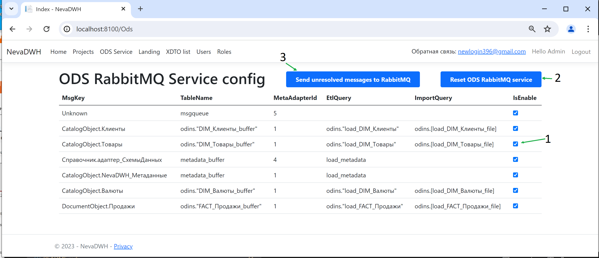
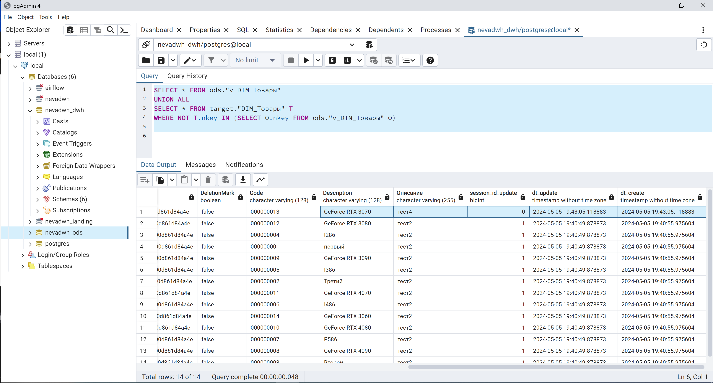

# NevaDWH

Generated DWH sample by NevaDWH generator. PostgreSql (folder dbpsql) and MSSQL (folder dbmssqll) version.

For start run ./start.ps1 batch on PowerShell 7.4 in Admin mode.


В этом проекте предствален результат генерации DWH из xml метаданных 1С, которые можно получить запустив 1cv8.exe /DumpConfigToFiles

### Prerequisites
- On Windows 10
- Install [Docker](https://www.docker.com/)
- Install [Docker Compose](https://docs.docker.com/compose/install/)
- Setup powershell in admin mode
```
Set-ExecutionPolicy -ExecutionPolicy RemoteSigned -Scope LocalMachine
```
- For MS-SQL install Server 2019 and Visual Studio Community 2022
- Install powershell Visual Studio library for deployment script MSqlDeploymentFunc.psm1
```
Install-Module VSSetup -Scope AllUsers
```

## Панел управления

[http://localhost:8100]()



Порядок тестирования версии PostgreSql в папке dbpsql:

Запустить docker-compose up, открыть административную панель, зарегистрировать первого пользователя Admin, перейти в раздел ODS Service.

1) Включить чекбоксы для обработки сообщений из RabbitMQ сервисом ODS. Если выключить все чекбоксы, то сообщения будут поступать в таблицу необработанных сообщений msgqueue.
2) Перезапустить сервис ODS обрабатывающий сообщения из RabbitMQ кнопкой "Reset ODS RabbitMQ service"
3) Отправить сообщения из таблицы необработанных сообщений msgqueue в RabbitMQ кнопкой "Send unresolved messages to RabbitMQ"

RabbitMQ
[http://localhost:15672]()
admin
admin

## ETL Airflow

[http://localhost:8080]()
airflow
airflow


4. Запустить в Airflow DAG dwh_etl_start, который архивирует накопленные данные в базе ODS и переносит их в DWH. В зависимости от интенсивности поступающих данных автоматический запуск ETL можно настроить на исполнение 1 раз в сутки, месяц или 5-20 мин.
5. Проверить в базе загруженные данные. Преимущество решения разделения баз на ODS и DWH в том, что загрузка из рабита осуществляется максимально быстро, в небольшую базу ODS содержащую дневную активность, без существенных локов постоянно меняющихся данных в таблицах. База DWH работает в основном на чтение, данные в неё из ODS загружаются ночью или в период наименьшей пользовательской активности. При необходимости, отчеты можно строить выбирая данные из 2х баз ипользуя UNION и linked(foreign) tables обьединяя исторические данные с данными дневной активности:



Для версии MSSQL все то же самое, за исключением того, что контейнер с сервером MSSQL не строится. Предполагается использование локального MS SQL Server 19 или 22. Batch файл start.ps1 компилирует проект dbproject.sln  Visual Studio 2022  созданный генератором и деплоит его на сервер создавая 3 базы. В версии MSSQL реализована обработка выгружаемых данных из 1C адаптером NevaDWH в файлы xml. Что позволяет оперативно перегружать любые обьемы данных не нагружая RabbitMQ. Для этих целей в batch файле start.ps1 создается File Share UPLOAD на которую нужно настроить 1C адаптер NevaDWH. Тестовая 1С база и 1С адаптер NevaDWH отсутствуют в данном репозитарии, тут представлен только результат работы генератора NevaDWH с тестовыми данными. Все сервисы написаны на .NET8.0 и опубликованы на Docker HUB как linux images.


В версии MSSQL есть отключаемый лог процедур для отладки процессов загрузки данных, который через Linked server LinkSRVLogLanding c опцией remote proc transaction promotion =false со всех 3х баз (Ods, Dwh, Landing)) сохраняется в общей таблице [nevadwh_landing].[audit].[LogProcedures]. Лог позволяет видеть подчиненые вызовы процедур, а так же их параметры для отладки.


Управление сервисами ODS и Landing:

[http://localhost:8090/swagger]()

[http://localhost:8092/swagger]()

Для связи и предложений по развитию проекта [newlogin396@gmail.com](mailto:newlogin396@gmail.com)
