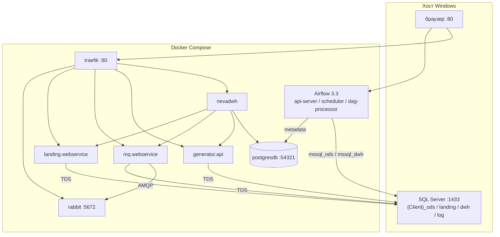

# Локальный стенд DWH (MS SQL)

Docker Compose для отладки сгенерированного DWH-клиента на **SQL Server**. Сервисы приложений берутся из образов `raulamailru/nevadwh-*`; Airflow и Rabbit — из локальной папки `images/`. Имя клиента и баз — из `.env` (`MQ_CLIENTNAME`, по умолчанию шаблона `NevaDWH-DEMO`).

HTTP UI с хоста идёт через **Traefik** на порт **80** (`http://localhost/...`). Прямые порты контейнеров оставлены для отладки.

## Состав и версии

| Сервис | Образ / сборка | Версия | Назначение |
|--------|----------------|--------|------------|
| **SQL Server** | на хосте (не в compose) | — | БД log / landing / ods / dwh (dacpac) |
| **traefik** | `traefik:v3.0` | 3.0 | Reverse proxy `:80`, только Docker labels (без `traefik.yml`) |
| **postgresdb** | `postgres:17.2-alpine` | 17.2 | Metadata Airflow, БД `nevadwh` |
| **rabbit** | `images/Rabbit` → `rabbitmq:4.3.4-management` | 4.3.4 | Очереди для `mq_ms` |
| **airflow-init** | `images/airflow` → `apache/airflow:3.3.0-python3.12` | 3.3.0 | Миграция БД Airflow, init |
| **api-server** | тот же образ Airflow | 3.3.0 | UI + REST API Airflow |
| **scheduler** | тот же образ Airflow | 3.3.0 | Планировщик DAG |
| **dag-processor** | тот же образ Airflow | 3.3.0 | Парсинг DAG (обязателен в AF3) |
| **mq.webservice** | `raulamailru/nevadwh-mq` | — | RabbitMQ → MSSQL (ODS) |
| **landing.webservice** | `raulamailru/nevadwh-landing` | — | API landing-слоя |
| **generator.api** | `raulamailru/nevadwh-generator` | — | Генератор DWH (xdto API) |
| **nevadwh** | `raulamailru/nevadwh-admin` | — | Веб-приложение / оркестрация |

Теги `raulamailru/nevadwh-{mq,landing,generator,admin}:X.Y.Z` задаются в `docker-compose.yml` (образы с Docker Hub).

Проект БД: `dbproject/` — landing, ods, dwh, log. Демо-сообщения 1С в ODS: PostDeploy `Dictionaries/messagequeue.sql` → `[mq].[MessageQueue]` (исходный dump — `070_msgqueue.sql`).

Автотесты пайплайна — из корня репозитория: `..\db-tests.ps1 dbmssql` (см. [README.md](../README.md)).

---

## Взаимодействие сервисов



**Поток данных (упрощённо):**

1. **MQ (`mq_ms`)** — читает сообщения из **RabbitMQ**, пишет в **MSSQL ODS** (схемы `mq`, `odins`, `etl`). На старте dacpac сеет демо-очередь `[mq].[MessageQueue]`.
2. **Landing** — **MSSQL landing**.
3. **Generator** — артефакты DWH по метаданным в **MSSQL ODS**.
4. **Airflow** — DAG'и в `ETLAirflow/dags`: `[etl].[dwh_AssignSessionID]` на ODS → `[mq].[sp_SaveSessionState]` на DWH → staging publish.
5. **NevaDWH** — UI; служебные данные в **Postgres** (`nevadwh`), HTTP к generator / mq / landing внутри compose-сети (не через Traefik).

---

## Предварительные требования

- Windows, **PowerShell от администратора** (для `start.ps1` и SMB share `Upload`)
- **SQL Server** на `localhost` (порт **1433**)
- **Docker Desktop**
- **Visual Studio / MSBuild** + **SqlPackage** (deploy dacpac через `dbdeploy.ps1`)
- `sqlcmd` в PATH
- Свободный **порт 80** (Traefik). `start.ps1` проверяет его до `docker compose up`: если занят — пишет процесс/контейнер и как освободить. Частые конфликты: другой Traefik (`docker-compose-price.yml` и т.п.), IIS (`net stop w3svc`).

---

## Быстрый запуск

Из **этого** каталога (`dbmssql/` сгенерированного клиента):

```powershell
# 1. Сборка образов (если нужны локальные images/)
docker compose build

# 2. Deploy MSSQL + пользователь + docker (первый раз — от администратора)
.\start.ps1

# Обновление только dacpac (MQ останавливается/запускается автоматически):
.\start.ps1 -IsUpdate
```

После старта браузер открывает http://localhost/ (NevaDWH через Traefik).

**Первый запуск Airflow 3** (или после смены major-версии) — пересоздать volume metadata:

```powershell
docker compose down --volumes
docker compose up airflow-init
docker compose up -d
```

---

## Учётные данные и адреса

Имя клиента ниже — из `.env` (`MQ_CLIENTNAME`). В шаблоне это `NevaDWH-DEMO`.

### Traefik (`localhost:80`)

Конфиг только в `docker-compose.yml` (`command` + labels, без папки `TraefikProxy`).

| Путь | Сервис |
|------|--------|
| http://localhost/ | NevaDWH admin |
| http://localhost/v1/xdto | generator.api (PathBase, без StripPrefix) |
| http://localhost/v1/xdto/api/swagger | Generator Swagger |
| http://localhost/v1/mq | mq.webservice (без StripPrefix) |
| http://localhost/v1/mq/swagger | MQ Swagger |
| http://localhost/v1/landing | landing.webservice (без StripPrefix) |
| http://localhost/v1/landing/swagger | Landing Swagger |
| http://localhost/rabbit/ | RabbitMQ management (`management.path_prefix`, слэш в конце обязателен) |
| http://traefik.localhost | дашборд Traefik |

Связь **между контейнерами** по-прежнему по именам сервисов (`http://generator.api:8080`, `rabbit:5672`), не через Traefik.

### SQL Server (хост)

| Параметр | Значение |
|----------|----------|
| Сервер | `localhost,1433` |
| Пользователь | `{MQ_CLIENTNAME}user` (шаблон: `NevaDWH-DEMOuser`) |
| Пароль | `MyPassword321` |
| Базы | `{Client}_log`, `{Client}_landing`, `{Client}_ods`, `{Client}_dwh` |

### PostgreSQL (контейнер `client-postgresdb17`)

Только metadata Airflow и БД `nevadwh`. **Не** очередь 1С: `070_msgqueue.sql` в Postgres не монтируется.

| Параметр | Значение |
|----------|----------|
| Host (с хоста) | `localhost:54321` |
| User / Password | `postgres` / `postgres` |
| Airflow DB | `airflow` |
| NevaDWH DB | `nevadwh` (создаётся приложением при необходимости) |

### RabbitMQ

| Параметр | Значение |
|----------|----------|
| AMQP | `localhost:5672` |
| Management UI (прямой) | http://localhost:15672/rabbit/ |
| Management UI (Traefik) | http://localhost/rabbit/ |
| Login / Password | `admin` / `admin` |

### Airflow 3.3

| Параметр | Значение |
|----------|----------|
| Web UI | http://localhost:8080 |
| Login / Password | `admin` / `admin` |
| Health | http://localhost:8080/api/v2/monitor/health |
| REST API v2 | http://localhost:8080/api/v2/ |
| Scheduler health | порт `8793` (внутренний) |
| DAG'и | `ETLAirflow/dags/` |
| Connections | `mssql_ods`, `mssql_dwh`, `postgres_*` (из `.env`) |

### MQ WebService (`mq_ms`)

| Параметр | Значение |
|----------|----------|
| HTTP (Traefik) | http://localhost/v1/mq |
| HTTP (прямой) | http://localhost:8090 |
| HTTPS | https://localhost:8091 |
| Swagger | http://localhost/v1/mq/swagger или http://localhost:8090/v1/mq/swagger |
| Status API | http://localhost:8090/v1/mq/service/status |
| Stop/Start (deploy) | `POST http://localhost:8090/v1/mq/service/stop`, `/start` |
| MSSQL (из контейнера) | `host.docker.internal` → ODS `{Client}_ods` |
| Rabbit (из контейнера) | `rabbit:5672` |

### Landing WebService

| Параметр | Значение |
|----------|----------|
| HTTP (Traefik) | http://localhost/v1/landing |
| HTTP (прямой) | http://localhost:8092 |
| HTTPS | https://localhost:8093 |
| Swagger | http://localhost/v1/landing/swagger или http://localhost:8092/v1/landing/swagger |
| MSSQL | `{Client}_landing` |

### Generator API

| Параметр | Значение |
|----------|----------|
| HTTP (Traefik) | http://localhost/v1/xdto |
| HTTP (прямой) | http://localhost:8110 |
| Swagger UI | http://localhost/v1/xdto/api/swagger |
| OpenAPI JSON | http://localhost/v1/xdto/api/swagger/v1/swagger.json |
| MSSQL | `{Client}_ods` |

### NevaDWH (веб-приложение)

| Параметр | Значение |
|----------|----------|
| HTTP (Traefik) | http://localhost/ |
| HTTP (прямой) | http://localhost:8100 |
| Swagger (Development) | http://localhost:8100/swagger |
| Postgres | `postgresdb:5432`, БД `nevadwh`, `postgres` / `postgres` |
| Generator (внутри compose) | http://generator.api:8080 |
| MQ (внутри compose) | http://mq.webservice:8080 |
| Landing (внутри compose) | http://landing.webservice:8080 |

---

## Сводная таблица URL

| Сервис | Traefik | Прямой порт | Логин | Пароль |
|--------|---------|-------------|-------|--------|
| NevaDWH App | http://localhost/ | http://localhost:8100 | *(auth стенда)* | — |
| Generator Swagger | http://localhost/v1/xdto/api/swagger | http://localhost:8110/api/swagger | — | — |
| MQ Swagger | http://localhost/v1/mq/swagger | http://localhost:8090/v1/mq/swagger | — | — |
| Landing Swagger | http://localhost/v1/landing/swagger | http://localhost:8092/v1/landing/swagger | — | — |
| Airflow UI | — | http://localhost:8080 | `admin` | `admin` |
| RabbitMQ Management | http://localhost/rabbit/ | http://localhost:15672/rabbit/ | `admin` | `admin` |
| Traefik dashboard | http://traefik.localhost | — | — | — |

---

## Полезные команды

```powershell
# Только compose (без dacpac)
docker compose up -d

# Логи
docker compose logs -f traefik api-server mq.webservice nevadwh

# Кто занял порт 80
Get-NetTCPConnection -LocalPort 80 -State Listen
docker ps --filter publish=80

# Пересборка одного сервиса (локальный Dockerfile / image tag в compose)
docker compose build mq.webservice
docker compose up -d mq.webservice

# Deploy dacpac вручную (сид MessageQueue — в ODS PostDeploy)
cd .\dbproject\ScriptsFolder
.\dbdeploy.ps1 -TargetServerName localhost `
  -TargetLogDBname NevaDWH-DEMO_log `
  -TargetLandingDBname NevaDWH-DEMO_landing `
  -TargetODSDBname NevaDWH-DEMO_ods `
  -TargetDWHDBname NevaDWH-DEMO_dwh `
  -IsRebuild

# Проверка DAG в контейнере Airflow
docker compose exec api-server airflow dags list
```

Подставьте имена баз из своего `.env`, если клиент не `NevaDWH-DEMO`.

---

## Структура каталога

```
dbmssql/
├── docker-compose.yml    # стек + Traefik labels
├── .env                  # из TemplateScript/dbmssql/setup/env.airflow.tmpl
├── start.ps1             # dacpac + проверка :80 + docker compose (setup/start_ps1.tmpl)
├── 070_msgqueue.sql      # исходный dump 1С; в MSSQL грузится через Dictionaries/messagequeue.sql
├── images/               # Dockerfile Airflow, Rabbit
├── ETLAirflow/
│   ├── dags/             # DAG'и (AF 3.3, схемы etl/mq/staging)
│   └── config/           # SimpleAuth passwords.json
├── dbproject/            # SSDT log/landing/ods/dwh
└── logs/                 # логи .NET-сервисов (volume)
```

---

## Переменные `.env` (основные)

| Переменная | Пример | Описание |
|------------|--------|----------|
| `MQ_CLIENTNAME` | `NevaDWH-DEMO` | Имя клиента для MQ/Landing |
| `MQ_DATABASE` | `NevaDWH-DEMO_ods` | ODS для MQ/Generator |
| `LANDING_DATABASE` | `NevaDWH-DEMO_landing` | Landing БД |
| `MQ_USER` / `MQ_PASSWORD` | `NevaDWH-DEMOuser` / `MyPassword321` | SQL login для сервисов |
| `MQ_SESSION_MODE` | `FullMode` | Режим MQ worker (`FullMode`, `BufferOnly`) |
| `RABBITMQ_DEFAULT_QUEUE` | `InfoBase` | Очередь RabbitMQ (как в legacy `mq`) |
| `RABBITMQ_EXCHANGE` | `amq.fanout` | Exchange RabbitMQ |
| `RABBITMQ_VIRTUAL_HOST` | `/` | Virtual host |
| `RABBITMQ_USER` / `RABBITMQ_PASSWORD` | `admin` / `admin` | Доступ к RabbitMQ |
| `SIMPLE_AUTH_MANAGER_*` + passwords.json | `admin` / `admin` | UI Airflow 3 (SimpleAuth, как RabbitMQ) |

---

## Примечания

- Контейнеры .NET подключаются к MSSQL через **`host.docker.internal`** — SQL Server должен слушать на хосте и принимать SQL-аутентификацию.
- Образы приложений — **`raulamailru/nevadwh-*`**. Локальная пересборка: `docker compose build` после правок в `mq_ms`, `dwhmanager`, `dwhgenerator`.
- Airflow **3.x**: вместо `webserver` — **`api-server`**, обязателен **`dag-processor`**. UI только на http://localhost:8080 (не за Traefik PathPrefix).
- Postgres в compose **не** является ODS: очередь сообщений живёт в MSSQL `[mq].[MessageQueue]`.
- Пароли в этом README — **только для локальной отладки**; не используйте их в production.
