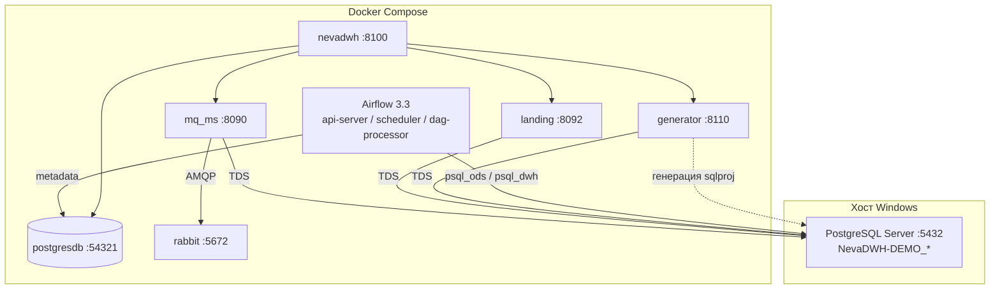

# NevaDWH-DEMO (dbpsql) — локальный стенд

Docker Compose для отладки PostgresSQL DWH-клиента **NevaDWH-DEMO**. Сервисы приложений это образы c docker.io/raulamailru/nevadwh-* ; образы Airflow и Rabbit — из локальной папки `images/`.

## Состав и версии

| Сервис                 | Образ / сборка                                 | Версия | Назначение                                 |
| ---------------------------- | --------------------------------------------------------- | ------------ | ---------------------------------------------------- |
| **SQL Server**         | на хосте (не в compose)                         | —           | БД log / landing / ods / dwh (dacpac)              |
| **postgresdb**         | `postgres:17.2-alpine`                                  | 17.2         | Metadata Airflow, БД`nevadwh`                    |
| **rabbit**             | `images/Rabbit` → `rabbitmq:4.3.4-management`        | 4.3.4        | Очереди для`mq_ms`                       |
| **airflow-init**       | `images/airflow` → `apache/airflow:3.3.0-python3.12` | 3.3.0        | Миграция БД Airflow, init                  |
| **api-server**         | тот же образ Airflow                            | 3.3.0        | UI + REST API Airflow                                |
| **scheduler**          | тот же образ Airflow                            | 3.3.0        | Планировщик DAG                           |
| **dag-processor**      | тот же образ Airflow                            | 3.3.0        | Парсинг DAG (обязателен в AF3)     |
| **mq.webservice**      | `src/services/mq_ms`                                    | .NET 10      | RabbitMQ → PostgreSQL (ODS)                         |
| **landing.webservice** | `src/services/dwhmanager`                               | .NET 8       | API landing-слоя                                 |
| **generator.api**      | `src/services/dwhgenerator`                             | .NET 8       | Генератор DWH (xdto API)                    |
| **nevadwh**            | `src/services/dwhmanager` (NevaDWH)                     | .NET 8       | Веб-приложение / оркестрация |

Проект БД (эталон схем): `dbproject/` — landing, ods, dwh, log.

---

## Взаимодействие сервисов



**Поток данных (упрощённо):**

1. **MQ (`mq_ms`)** — читает сообщения из **RabbitMQ**, пишет в **PostgreSQL ODS** (`NevaDWH-DEMO_ods`, схемы `mq`, `odins`, `etl`).
2. **Landing** — работает с **PostgreSQL landing** (`NevaDWH-DEMO_landing`).
3. **Generator** — генерация/обновление артеfactов DWH по метаданным в **PostgreSQL ODS**.
4. **Airflow** — DAG'и в `ETLAirflow/dags`: `etl.dwh_AssignSessionID` на ODS → `mq.sp_SaveSessionState` на DWH → staging publish-процедуры.
5. **NevaDWH** — UI и API; хранит служебные данные в **Postgres** (`nevadwh`), вызывает generator / mq / landing по HTTP внутри compose-сети.

---

## Предварительные требования

- Windows, **PowerShell от администратора** (для `start.ps1` и SMB share `Upload`)
- **PostgreSQL Server** на `localhost` (порт **5432**)
- **Docker Desktop**
- **Visual Studio / MSBuild** + **SqlPackage** (для deploy dacpac через `dbdeploy.ps1`)
- `sqlcmd` в PATH

---

## Быстрый запуск

```powershell
cd F:\Work\GitLab\gitlab26.neva.loc\shop\publicdwh_nodejs\src\dbprojects\dbpssql

# 1. Сборка образов
docker compose build

# 2. Deploy PostgreSQL + пользователь + docker (первый раз — от администратора)
.\start.ps1

# Обновление (MQ останавливается/запускается автоматически):
.\start.ps1 -IsUpdate
```

**Первый запуск Airflow 3** (или после смены major-версии) — пересоздать volume metadata:

```powershell
docker compose down --volumes
docker compose up airflow-init
docker compose up -d
```

---

## Учётные данные и адреса

### SQL Server (хост)

| Параметр         | Значение                                                                           |
| ------------------------ | ------------------------------------------------------------------------------------------ |
| Сервер             | `localhost,1433`                                                                         |
| Пользователь | `NevaDWH-DEMOuser`                                                                       |
| Пароль             | `MyPassword321`                                                                          |
| Базы                 | `NevaDWH-DEMO_log`, `NevaDWH-DEMO_landing`, `NevaDWH-DEMO_ods`, `NevaDWH-DEMO_dwh` |

### PostgreSQL (контейнер `client-postgresdb17`)

| Параметр     | Значение                                                                          |
| -------------------- | ----------------------------------------------------------------------------------------- |
| Host (с хоста) | `localhost:54321`                                                                       |
| User / Password      | `postgres` / `postgres`                                                               |
| Airflow DB           | `airflow`                                                                               |
| NevaDWH DB           | `nevadwh` (создаётся приложением при необходимости) |

### RabbitMQ

| Параметр | Значение       |
| ---------------- | ---------------------- |
| AMQP             | `localhost:5672`     |
| Management UI    | http://localhost:15672 |
| Login / Password | `admin` / `admin`  |

### Airflow 3.3

| Параметр | Значение                                             |
| ---------------- | ------------------------------------------------------------ |
| Web UI           | http://localhost:8080                                        |
| Login / Password | `airflow` / `airflow`                                    |
| Health           | http://localhost:8080/api/v2/monitor/health                  |
| REST API v2      | http://localhost:8080/api/v2/                                |
| Scheduler health | порт`8793` (внутренний)                      |
| DAG'и           | `ETLAirflow/dags/`                                         |
| Connections      | `mssql_ods`, `mssql_dwh`, `postgres_*` (из `.env`) |

### MQ WebService (`mq_ms`)

| Параметр                       | Значение                                         |
| -------------------------------------- | -------------------------------------------------------- |
| HTTP                                   | http://localhost:8090                                    |
| HTTPS                                  | https://localhost:8091                                   |
| Swagger                                | http://localhost:8090/swagger                            |
| Status API                             | http://localhost:8090/v1/mq/service/status               |
| Stop/Start (deploy)                    | `POST http://localhost:8090/api/Home/Stop`, `/Start` |
| PostgreSQL (из контейнера) | `host.docker.internal` → ODS `NevaDWH-DEMO_ods`     |
| Rabbit (из контейнера)     | `rabbit:5672`                                          |

### Landing WebService

| Параметр | Значение              |
| ---------------- | ----------------------------- |
| HTTP             | http://localhost:8092         |
| HTTPS            | https://localhost:8093        |
| Swagger          | http://localhost:8092/swagger |
| PostgreSQL       | `NevaDWH-DEMO_landing`      |

### Generator API

| Параметр | Значение                                  |
| ---------------- | ------------------------------------------------- |
| HTTP             | http://localhost:8110                             |
| Swagger UI       | http://localhost:8110/api/swagger                 |
| OpenAPI JSON     | http://localhost:8110/api/swagger/v1/swagger.json |
| PostgreSQL       | `NevaDWH-DEMO_ods`                              |

### NevaDWH (веб-приложение)

| Параметр                 | Значение                                                   |
| -------------------------------- | ------------------------------------------------------------------ |
| HTTP                             | http://localhost:8100                                              |
| Swagger (Development)            | http://localhost:8100/swagger                                      |
| Postgres                         | `postgresdb:5432`, БД `nevadwh`, `postgres` / `postgres` |
| Generator (внутри compose) | http://generator.api:8080                                          |
| MQ (внутри compose)        | http://mq.webservice:8080                                          |
| Landing (внутри compose)   | http://landing.webservice:8080                                     |

---

## Сводная таблица URL

| Сервис        | URL                               | Логин                                        | Пароль |
| ------------------- | --------------------------------- | ------------------------------------------------- | ------------ |
| Airflow UI          | http://localhost:8080             | `airflow`                                       | `airflow`  |
| RabbitMQ Management | http://localhost:15672            | `admin`                                         | `admin`    |
| MQ Swagger          | http://localhost:8090/swagger     | —                                                | —           |
| Landing Swagger     | http://localhost:8092/swagger     | —                                                | —           |
| Generator Swagger   | http://localhost:8110/api/swagger | —                                                | —           |
| NevaDWH Swagger     | http://localhost:8100/swagger     | —                                                | —           |
| NevaDWH App         | http://localhost:8100             | *(зависит от настройки auth)* | —           |

---

## Полезные команды

```powershell
# Только compose (без dacpac)
docker compose up -d

# Логи
docker compose logs -f api-server mq.webservice nevadwh

# Пересборка одного сервиса после правок в src/services
docker compose build mq.webservice
docker compose up -d mq.webservice

# Deploy dacpac вручную
cd .\dbproject\ScriptsFolder
.\dbdeploy.ps1 -TargetServerName localhost `
  -TargetLogDBname NevaDWH-DEMO_log `
  -TargetLandingDBname NevaDWH-DEMO_landing `
  -TargetODSDBname NevaDWH-DEMO_ods `
  -TargetDWHDBname NevaDWH-DEMO_dwh `
  -IsRebuild

# Проверка DAG в контейнере Airflow
docker compose exec api-server airflow dags list
```

---

## Структура каталога

```
dbpsql/
├── docker-compose.yml    # compose-стек
├── .env                  # генерируется из TemplateScript/dbpsql/setup/env.airflow.tmpl
├── start.ps1             # dacpac deploy + docker compose up (setup/start_ps1.tmpl)
├── images/               # Dockerfile Airflow, Rabbit
├── ETLAirflow/
│   ├── dags/             # DAG'и (AF 3.3, схемы etl/mq/staging)
│   └── config/           # SimpleAuth passwords.json
├── dbproject/            # SSDT-проекты log/landing/ods/dwh
└── logs/                 # логи .NET-сервисов (volume)
```

---

## Переменные `.env` (основные)

| Переменная                       | Пример                             | Описание                                    |
| ------------------------------------------ | ---------------------------------------- | --------------------------------------------------- |
| `MQ_CLIENTNAME`                          | `NevaDWH-DEMO`                         | Имя клиента для MQ/Landing             |
| `MQ_DATABASE`                            | `NevaDWH-DEMO_ods`                     | ODS для MQ/Generator                             |
| `LANDING_DATABASE`                       | `NevaDWH-DEMO_landing`                 | Landing БД                                        |
| `MQ_USER` / `MQ_PASSWORD`              | `NevaDWH-DEMOuser` / `MyPassword321` | SQL login для сервисов                   |
| `MQ_SESSION_MODE`                        | `FullMode`                             | Режим MQ worker (`FullMode`, `BufferOnly`) |
| `RABBITMQ_DEFAULT_QUEUE`                 | `InfoBase`                             | Очередь RabbitMQ (как в legacy`mq`)    |
| `RABBITMQ_EXCHANGE`                      | `amq.fanout`                           | Exchange RabbitMQ                                   |
| `RABBITMQ_VIRTUAL_HOST`                  | `/`                                    | Virtual host                                        |
| `RABBITMQ_USER` / `RABBITMQ_PASSWORD`  | `admin` / `admin`                    | Доступ к RabbitMQ                            |
| `SIMPLE_AUTH_MANAGER_*` + passwords.json | `airflow` / `airflow`                | UI Airflow 3 (SimpleAuth)                           |

---

## Примечания

- Контейнеры .NET подключаются к PostgreSQL через **`host.docker.internal`** — SQL Server должен слушать на хосте и принимать SQL-аутентификацию.
- Образы приложений пересобираются из **`../../services/`** — правки в `mq_ms`, `dwhmanager`, `dwhgenerator` требуют `docker compose build`.
- Airflow **3.x**: вместо `webserver` используется **`api-server`**, обязателен **`dag-processor`**.
- Пароли в этом README — **только для локальной отладки**; не используйте их в production.
